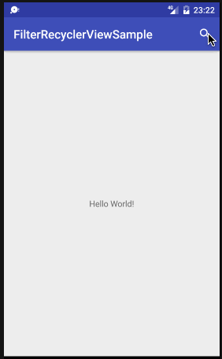

Filter Recycler View
========

RecyclerView with incremental search action.



## Usage
__Add the dependencies to your gradle file.__

```
allprojects {
    repositories {
        ...
        maven { url 'https://jitpack.io' }
    }
}
```

```
dependencies {
    ...
    compile 'com.github.rei-m:filter-recyclerview:1.0.0'
}
```

__Create Adapter extends FilterRecyclerAdapter.__

Example.

```
class MainFilterRecyclerAdapter extends FilterRecyclerAdapter<ListItem> {

    private LayoutInflater inflater;

    MainFilterRecyclerAdapter(Context context) {
        inflater = LayoutInflater.from(context);
    }

    @Override
    public boolean filterByConstraint(@NonNull ListItem item, @NotNull String constraint) {

        // SetUp constraint of filter.
        String lowerName = item.getName().toLowerCase();
        String lowerConstraint = constraint.trim().toLowerCase();

        return lowerName.contains(lowerConstraint);
    }

    @Override
    public RecyclerView.ViewHolder onCreateViewHolder(ViewGroup parent, int viewType) {
        return new ItemViewHolder(inflater.inflate(R.layout.item_row, parent, false));
    }

    @Override
    public void onBindViewHolder(RecyclerView.ViewHolder holder, int position) {
        ((ItemViewHolder) holder).initialize(findItemByPosition(position));
    }

    private class ItemViewHolder extends RecyclerView.ViewHolder {

        private TextView textName;

        ItemViewHolder(View itemView) {
            super(itemView);
            textName = (TextView) itemView.findViewById(R.id.item_row_name);
        }

        private void initialize(ListItem listItem) {
            textName.setText(listItem.getName() + " / " + listItem.getCategory());
        }
    }
}
```

__Add FilterRecyclerView to your layout.__

Example.

```
<android.support.design.widget.CoordinatorLayout     android:layout_width="match_parent"
    android:layout_height="match_parent">

    <android.support.design.widget.AppBarLayout
        android:layout_width="match_parent"
        android:layout_height="wrap_content"
        android:theme="@style/AppTheme.AppBarOverlay">

        <android.support.v7.widget.Toolbar
            android:id="@+id/toolbar"
            android:layout_width="match_parent"
            android:layout_height="?attr/actionBarSize"
            android:background="?attr/colorPrimary"
            app:popupTheme="@style/AppTheme.PopupOverlay" />

    </android.support.design.widget.AppBarLayout>

    <RelativeLayout
        android:layout_width="match_parent"
        android:layout_height="match_parent"
        android:layout_marginTop="?attr/actionBarSize">

        <TextView
            android:layout_width="wrap_content"
            android:layout_height="wrap_content"
            android:layout_centerInParent="true"
            android:text="Hello World!" />

    </RelativeLayout>

    <com.reim.android.filterrecyclerview.FilterRecyclerView
        android:layout_width="match_parent"
        android:layout_height="match_parent"
        app:filterHint="Input Name" />

</android.support.design.widget.CoordinatorLayout>
```

__Set adapter to FilterRecyclerView and initialize list item.__

```
filterRecyclerView = (FilterRecyclerView) findViewById(R.id.activity_main_filter_recycler_view);
filterRecyclerView.setAdapter(new MainFilterRecyclerAdapter(this));

List<ListItem> itemList = new ArrayList<>();
itemList.add(new ListItem("Sam", "Dog"));
itemList.add(new ListItem("Spot", "Cat"));
itemList.add(new ListItem("Pip", "Cat"));
itemList.add(new ListItem("Piper", "Dog"));

filterRecyclerView.initializeItemList(itemList);
```

## Licence

[MIT](LICENCE.txt)

## Author

[rei-m](https://github.com/rei-m)
